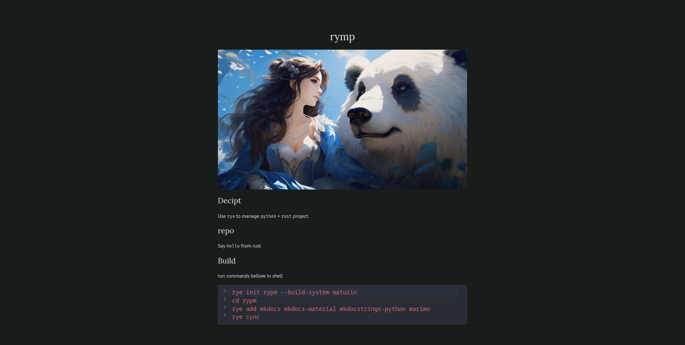

# rypm

Template repo: `rye` manage `python` + `rust` project.

## show
Show project with [`marimo`](https://marimo.io):


## init

```sh
rye init repo --build-system maturin
cd repo
# rye pin 3.12
rye add --dev pip
# rye install maturin
rye sync
```

## docs

Init docs.

`duties.py`:

```sh
rye add mkdocs mkdocs-material mkdocstrings-python
rye sync
rye run mkdocs new ./
```

Change theme of docs.

`mkdocs.yml`:

```yml
site_name: project
theme: material

nav:
  - Home: index.md
  - python: python.md

plugins:
- search
- mkdocstrings:
    handlers:
      python:
        paths: [python.project]
        options:
          show_source: false
```

Build docs.

```sh
rye run mkdocs build
```
